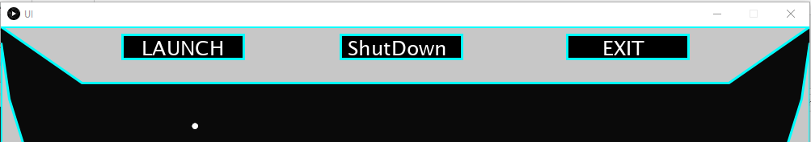

# OOP Assignment
================

# Space Ship

Name : Sahil Sahil

Student Number : D17124269


# Description of the Assignment

This assignment is about to create the user interface for sci-fi idea which can be used in any sci-fi movie. It was done in language called java and processing. My User Interface is Space Ship control panel and this idea came from Avengers (Ender's Game) when iron man is stuck in ship. So, then i decided to make interface like that but mine is slightely different. Through this assignment i learnt alot not only how to code and improve skills but also how to work/manage time under pressure ( as we were having other assignments at the same time).

# Instructions 

The User must compile and run the program, the screen ( first screen) will be displayed which has background image of space and an loading bar. 
When loading bar gonna finish it will prompt the user to new screen and that's my main screen. The main screen contains Three buttons. First, an Launch button which will launch the features of ship, Second, Shutdown button will make features stop working and Third, Exit button will close the program and brings user to git again if he/she wants to start all over again.

### 3 Buttons on Top from Left to right which are :

* Launch button
* ShutDown button
* Exit button

# How it works

In Total i created 11 classes for my program to work which are:

* LdTable - Loads table from csv file. 

* Main - It is used to execute the UI class.

* SpaceObject - It is an Abstract class

* ComingStars - this class is used for displaying random stars on the screen.

```
 public  ComingStars(UI ui)
    {
        this.ui = ui;
    }
    public void render()
    {
        float r = ui.random(0,1000);
        float w = ui.random(70,500);

```
* BarLoad - Firstly, this class is responsible for making loading bar, which iterates an counter on rectangle and also it is sub-class of SpaceObject. Secondly, it has a background image which gives it massive impression.

* Object - This class is used to make two ( on left and right ) moving objects. For making them i used the math function and transform functions . Here is the example of push and pop matrix :

```
public void draw()
    {
        // for left object 
        ui.pushMatrix();
        ui.translate(40,350);
        ui.rotate(ui.frameCount/200);
        drawObject(0,0,20,30,50);
        ui.popMatrix();


        // for right object
        ui.pushMatrix();
        ui.translate(960,350);
        ui.rotate(ui.frameCount/200);
        drawObject(0,0,20,30,50);
        ui.popMatrix();

    }

```
* Radar - This class make an Radar, in which i used maths function and also made an cool thing in the middle of radar.

* Rects - I was using this class before, so now it doesn't do anything suspicious.

* Sketch - This class is basically used for making the interior sketch of space ship using different functions.

```
  // left part 
            ui.beginShape();
            ui.strokeWeight(3);
            ui.vertex(0, 20);
            ui.vertex(10,90);
            ui.vertex(100, 380);
            ui.vertex(0,480);
            ui.endShape(ui.CLOSE);


            // right part
            ui.beginShape();
            ui.strokeWeight(3);
            ui.vertex(1000, 20);
            ui.vertex(990, 90);
            ui.vertex(900, 380);
            ui.vertex(1000, 480);
            ui.endShape(ui.CLOSE);

```

* UI - This class contains lots of stuff so i am gonna tell u about few common things which includes :
```
.:

 variables and inialized them

 declare Arrays and Arraylists

 loading sound files and load table from csv file

 used KeyPressed() and checkkey() functions

 loops, methods

 ```
Here is the exmaple from code

 ```
  public void mousePressed()
    {
        if((mouseX > 150 && mouseX < 300) && (mouseY > 10 && mouseY < 40))
        {
            mode = 1;
        } else if((mouseX > 420 && mouseX < 570) && (mouseY > 10 && mouseY < 40))
        {
            mode = 0;
        }
        else if((mouseX > 700 && mouseX < 850) && (mouseY > 10 && mouseY < 40))
        {
            System.exit(0);
        }
    }


    public void draw()
    {
    
                    rocket2.play();
                    //alien.rewind();

                    background(255);
                    stroke(255);
                    line(200, 200, mouseX, mouseY);
                    //println(mouseX, mouseY);
                    noFill();
                    int k = loadbar(counter);
                    counter += 2;
                    
                    if(k>=200)
                    {
                        clearScreen();
                    
                    
                        for(int i = items.size()-1; i>=0;i--)
                            {
                                SpaceObject j = items.get(i);
                                j.render();
                                
                        
                            }
                        stars.update();
                    }
                    // bar1.drawRects();
                   
   
    }

 ```

 # Variables and Loop

Here i have used if / else statements so that one rectangle can iterate over another using counter. 

```
     public void render()
   {
    img = ui.loadImage("planetImageResize.jpg");
    counter++;
    
    ui.rect(50,450,200,50);
    ui.image(img,0,0);
    update(counter);

    ui.fill(255);
    //ui.textAlign(CENTER);
    //FONT font1 = new Font("SansSerif", Font.BOLD,20);
    ui.text("PROJECT : AVENGERS ENDER GAME",400,200);
    ui.stroke(0,255,255);
   }
   public void update(int inc)
   {
        if(inc<200)
    {  
        ui.fill(0);
        ui.rect(50,450,inc,50);
        ui.stroke(200);
    }
    if(inc>=200)
    {
        ui.fill(0);
        ui.rect(50,450,200,50);
        
    }

```

* Here is the output how it looks on screen


# What I am most proud of in the Assignment

What am i proud of about overall appearance and novelty in my UI and also i did the same thing which i consider to do at the starting. At starting i was just thinking how i am gonna do it but by doing small bits everyday it makes easy for me. I faced few difficulties during the entire time span but i learnt how to overcome them and having hours of research and many attempts made it finally to work.

# Markdown Tutorial

## Interactive ( Buttons)

There are 3 buttons 

* Launch = Start various features like start radar,histogram,etc.

* Shutdown = This button will turn off many functions as discussed above.

* Exit =  Close the program.



```
 public void mousePressed()
    {
        if((mouseX > 150 && mouseX < 300) && (mouseY > 10 && mouseY < 40))
        {
            mode = 1;
        } else if((mouseX > 420 && mouseX < 570) && (mouseY > 10 && mouseY < 40))
        {
            mode = 0;
        }
        else if((mouseX > 700 && mouseX < 850) && (mouseY > 10 && mouseY < 40))
        {
            System.exit(0);
        }
    }

```
* Them both are in different classes and also i want to mention that i couldn't do that using math function so have to hard code. 
```
  ui.rect(150,10,150,30); //x,y,width,height
            ui.rect(700,10,150,30);
            ui.rect(420, 10, 150, 30); 
            ui.fill(255);   
            ui.stroke(255);
            ui.textAlign(PApplet.CENTER,PApplet.CENTER);
            ui.text("LAUNCH",225,23);
            ui.text("ShutDown",490,23);
            ui.text("EXIT",770,23);

```
## Interactive ( Mouse)

* Here, i made mouseX and mouseY which will tell the co-ordinates and it just for fun basically, doesn't use any hard coding.


```
  ui.textSize(15);
            ui.fill(0);
            ui.text(ui.mouseX, 475,480);

            ui.text(ui.mouseY, 515, 475);
           
            ui.fill(0);

```

## Interactive ( Stars)

* This class will generate random stars and it is sub-class of SpaceObject

* As we looking at the image and we can only see one star that is because they are going really fast so can't capture them all of them.


```
 public void render()
    {
        float r = ui.random(0,1000);
        float w = ui.random(70,500);
        // it will increase the speed of star occuring on screen
        ui.noStroke();
        ui.fill(0,0);
        ui.rect(0,0,1000,799);
        ui.fill(255);
        ui.ellipse(r,w,7,7);
        ui.ellipse(r,w,7,7);
        ui.ellipse(r,w,7,7);
        ui.ellipse(r,w,7,7);
        ui.ellipse(r,w,7,7);
        ui.noStroke();  
    }

```

## CSV File 

* The csv file which i used is Planets.csv and that contains the name of planets and random numbers.

* The place where i used that is UI.java

* But there was a problem here, i can print it to git console but not in UI program. so, i have make my histogram manually at the bottom of interface.

```
  
    public void loadWaves()
	{
		Table table = loadTable("Planets.csv", "header");
        for(TableRow row : table.rows())
        {
            Wave wa = new Wave(row);
            waves.add(w);
        }

    }
    
    
    public void printWaves()
	{
		for(int i = 0; i < waves.size(); i++)
		{
            System.out.println(waves.get(i));
		}
	}

```

# The unit circle and trigonometry 

* I used maths functions and all in making moving object on both left and right sides.

* Below is the code which i used 

```
 ui.beginShape();

        for(float i = 0; i< ui.TWO_PI; i += angle)
        {
            float sx  = x + ui.cos(i) * r2;
            float sy = y + ui.sin(i) * r1;
            ui.vertex(sx,sy);

            sx = x + ui.cos(i + halfAngle) * r1;
            sy = y + ui.sin(i + halfAngle) * r2;

            ui.vertex(sx,sy);
        }
ui.endShape(ui.CLOSE);

``` 


# Transforms

*  I use this for my Object which is on both sides of main screen

* pushMatrix - It will save current position of object

* popMatrix -  It will restore prior position.

* translate - will basically move origin point.

* rotate

```
 public void draw()
    {
        // for left object 
        ui.pushMatrix();
        ui.translate(40,350);
        ui.rotate(ui.frameCount/200);
        drawObject(0,0,20,30,50);
        ui.popMatrix();


        // for right object
        ui.pushMatrix();
        ui.translate(960,350);
        ui.rotate(ui.frameCount/200);
        drawObject(0,0,20,30,50);
        ui.popMatrix();

    }

```
# Polymorphism

*  ComingStars was created as a child of SpaceObject

```
public class ComingStars extends SpaceObject
{
    //UI ui;
    
    public  ComingStars(UI ui)
    {
        super(ui);
    }
    public void render()
    {
        float r = ui.random(0,1000);
        float w = ui.random(70,500);
        // it will increase the speed of star occuring on screen
        ui.noStroke();
        ui.fill(0,0);
        ui.rect(0,0,1000,799);
        ui.fill(255);
        ui.ellipse(r,w,7,7);
        ui.ellipse(r,w,7,7);
        ui.ellipse(r,w,7,7);
        ui.ellipse(r,w,7,7);
        ui.ellipse(r,w,7,7);
        ui.noStroke();
        
  
    }

```
* loop with the arraylist rendering each object

```
    ArrayList<SpaceObject> items = new ArrayList<SpaceObject>();


```

# Abstract Class 

*  This class displays only essential information and hide the details.

* That's my abstraction class  and it has two sub-class.

```
public abstract class SpaceObject 
{
    PApplet ui;

    public SpaceObject(UI ui)
    {
        this.ui = ui;
    }

    public void render()
    {

    }
    public void update()
    {
        
    }
}

```

# Inheritance 

* In this class, the idea behind this is that you create a new classes that are built upon existing class( i.e parent object which is UI class and all other objects aquires all the properties from there).

```

public class BarLoad extends SpaceObject
{
    //UI ui;
    int counter;
    private PImage img;
    
   public BarLoad(UI ui)
   {
       super(ui);

   }
   public void render()
   {
    img = ui.loadImage("planetImageResize.jpg");
    counter++;
    
    ui.rect(50,450,200,50);
    ui.image(img,0,0);
    update(counter);

    ui.fill(255);
    //ui.textAlign(CENTER);
    //FONT font1 = new Font("SansSerif", Font.BOLD,20);
    ui.text("PROJECT : AVENGERS ENDER GAME",400,200);
    ui.stroke(0,255,255);
   }

```
* Interior Control Panel for Space Ship


* Youtube Link: [](https://www.youtube.com/watch?v=rXdIkOKtHzI&feature=youtu.be)


